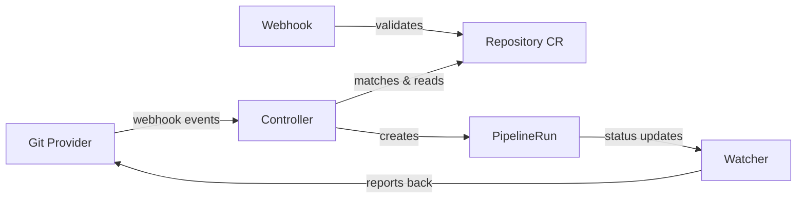

This page explains the architecture, components, and key concepts behind Pipelines-as-Code. Read this page to understand how events flow from your Git provider through to PipelineRun execution, so you can configure and troubleshoot your CI/CD pipelines effectively.

## Architecture overview

Pipelines-as-Code consists of three main components that work together to provide a complete CI/CD solution for Tekton.



### Controller

The **controller** (`pipelines-as-code-controller`) is the central component. It receives webhook events from Git providers and orchestrates pipeline execution. Specifically, the controller:

- Receives webhook events from Git providers (push, pull request, etc.)
- Matches events to Repository CRs in the cluster
- Fetches pipeline definitions from the `.tekton/` directory in your repository
- Resolves remote tasks from Tekton Hub or Artifact Hub
- Validates pipeline YAML before submission
- Creates PipelineRuns in the appropriate namespace
- Injects authentication tokens and secrets
- Handles authorization checks (OWNERS files, permissions)

The controller uses the Knative eventing adapter pattern to handle events efficiently and scale based on load.

### Watcher

The **watcher** (`pipelines-as-code-watcher`) monitors PipelineRun execution and reports status back to your Git provider. Specifically, the watcher:

- Watches for PipelineRun status changes in real-time
- Collects task logs and error information
- Posts status updates to Git providers (GitHub Checks, GitLab pipelines, etc.)
- Creates comments on pull requests with execution details
- Extracts error snippets and matches them to source code lines
- Updates Repository CR status with recent PipelineRun history

The watcher runs as a separate process with multiple reconcilers for efficient status reporting across many repositories.

### Webhook

The **webhook** (`pipelines-as-code-webhook`) is a Kubernetes admission webhook that validates and secures Repository CRs. It:

- Validates Repository CRs before they are created or updated
- Enforces that each repository URL is unique across the cluster
- Validates that repository URLs are well-formed and non-empty
- Prevents security issues from duplicate or invalid repositories


Disabling this webhook is not supported and may pose a security risk in clusters with untrusted users, as it could allow one user to hijack another’s repository.


## Repository CR

The Repository CR is the core configuration object in Pipelines-as-Code. You create one Repository CR per Git repository you want to connect, and it tells Pipelines-as-Code everything it needs to handle events for that repository.

A Repository CR:

- Tells Pipelines-as-Code that events from a specific URL should be handled
- Specifies the namespace where PipelineRuns execute
- References API secrets, usernames, or API URLs for Git provider authentication
- Stores the last PipelineRun statuses (5 by default)
- Allows you to declare custom parameters that Pipelines-as-Code expands in PipelineRuns

### Example

```yaml
apiVersion: "pipelinesascode.tekton.dev/v1alpha1"
kind: Repository
metadata:
  name: my-project
  namespace: my-project-ci
spec:
  url: "https://github.com/myorg/my-project"
  settings:
    pipelinerun_provenance: "source"
    policy:
      ok_to_test:
        - "maintainer1"
        - "maintainer2"
  concurrency_limit: 2
```

### Key fields

#### `spec.url`

The Git repository URL that this Repository CR manages. Must be a valid HTTP/HTTPS URL.

```yaml
spec:
  url: "https://github.com/myorg/my-project"
```

#### `spec.concurrency_limit`

Maximum number of concurrent PipelineRuns for this repository. Use this to prevent resource exhaustion.

```yaml
spec:
  concurrency_limit: 3
```

#### `spec.settings`

Configuration settings including authorization policies, provider-specific options, and provenance.

```yaml
spec:
  settings:
    pipelinerun_provenance: "default_branch"
    policy:
      ok_to_test:
        - "trusted-user"
```

#### `spec.git_provider`

Git provider authentication details, used for webhook-based integrations.

```yaml
spec:
  git_provider:
    type: "gitlab"
    url: "https://gitlab.example.com"
    secret:
      name: "gitlab-token"
      key: "token"
```


You cannot create a Repository CR in the same namespace where Pipelines-as-Code is deployed (for example, the `pipelines-as-code` namespace).


## Event flow

Understanding how events flow through Pipelines-as-Code helps you troubleshoot issues and optimize your pipelines. The following steps describe the full lifecycle from a Git event to a completed PipelineRun.

### 1. Git event occurs

A developer performs an action in the Git repository, such as:

- Pushing code to a branch
- Opening a pull request
- Commenting on a pull request
- Creating a tag
- Merging a pull request

### 2. Webhook sent to controller

The Git provider sends a webhook payload to the Pipelines-as-Code controller endpoint. The controller verifies authentication using:

- GitHub App JWT signature (for GitHub Apps)
- Webhook secret (for webhook-based integrations)

### 3. Repository lookup

The controller extracts the repository URL from the webhook payload and:

- Searches for a matching Repository CR across all namespaces
- If a `target-namespace` annotation exists in the pipeline, searches only that namespace
- Validates that exactly one Repository CR matches

### 4. Authorization check

Before running any pipeline, the controller verifies that the user has permission to trigger pipelines. It checks:

- Repository ownership
- Collaborator status
- Organization membership
- OWNERS file in the repository
- Policy configuration in the Repository CR

### 5. Fetch pipeline definitions

The controller clones the repository (or fetches from the default branch based on provenance settings) and:

- Looks for `.tekton/*.yaml` files in the repository
- Parses and validates the YAML syntax

### 6. Match pipelines to event

For each pipeline definition found, the controller checks whether:

- The `pipelinesascode.tekton.dev/on-event` annotation matches the event type
- The `pipelinesascode.tekton.dev/on-target-branch` annotation matches the branch
- Any CEL expressions in `pipelinesascode.tekton.dev/on-cel-expression` evaluate to true
- Path filters match the changed files

### 7. Resolve remote tasks

If your pipeline references external tasks, the controller:

- Identifies tasks referenced via `resolver: hub` or `resolver: bundles`
- Fetches task definitions from Tekton Hub, Artifact Hub, or OCI bundles
- Inlines remote tasks into the pipeline definition
- Validates the complete pipeline

### 8. Variable substitution

The controller replaces template variables with values from the event context:

- `{{ repo_url }}` - Full repository URL
- `{{ revision }}` - Git commit SHA
- `{{ target_branch }}` - Target branch name
- `{{ source_branch }}` - Source branch name
- Custom parameters from the Repository CR

### 9. Create PipelineRuns

With everything resolved, the controller:

- Creates PipelineRun resources in the namespace where the Repository CR exists
- Injects Git provider tokens as secrets
- Applies concurrency limits if configured
- Queues PipelineRuns if the concurrency limit has been reached

### 10. Monitor execution

Once PipelineRuns are created, the watcher takes over and:

- Watches PipelineRuns for status changes
- Collects logs from each task as they execute
- Detects task failures and extracts error messages

### 11. Report status

As PipelineRuns complete, the watcher:

- Posts status checks to the Git provider (GitHub Checks, GitLab pipeline status)
- Creates or updates comments on pull requests
- Links to the dashboard or logs for detailed information
- Annotates source code lines with error messages (GitHub only)

### 12. Update Repository CR

Finally, the watcher:

- Updates the Repository CR status with PipelineRun completion information
- Stores the last 5 PipelineRun statuses by default
- Includes commit SHA, title, status, and log URL

## Pipeline definitions

Pipeline definitions in Pipelines-as-Code are standard Tekton PipelineRuns with special annotations. These annotations tell Pipelines-as-Code when and how to run each pipeline.

### Annotations

#### `on-event`

Specifies which Git events trigger this pipeline.

```yaml
annotations:
  pipelinesascode.tekton.dev/on-event: "[pull_request, push]"
```

Supported events:

- `pull_request` - PR opened, synchronized, or reopened
- `push` - Code pushed to a branch
- `incoming` - Manual trigger via incoming webhook

#### `on-target-branch`

Specifies which branches this pipeline applies to. Supports glob patterns and regular expressions.

```yaml
annotations:
  pipelinesascode.tekton.dev/on-target-branch: "[main, develop, release/*]"
```

#### `on-cel-expression`

Provides advanced event matching using CEL (Common Expression Language). You have access to the full webhook payload via the `body` variable.

```yaml
annotations:
  pipelinesascode.tekton.dev/on-cel-expression: |
    event == "pull_request" && !body.pull_request.draft
```

#### `on-path-change`

Triggers the pipeline only if specific files or paths changed. This is useful for monorepos and selective testing.

```yaml
annotations:
  pipelinesascode.tekton.dev/on-path-change: "[src/**, tests/**]"
```

### Template variables

Pipelines-as-Code provides template variables that are substituted at runtime:

| Variable | Description | Example |
| --- | --- | --- |
| `{{ repo_url }}` | Full repository URL | `https://github.com/myorg/myrepo` |
| `{{ revision }}` | Git commit SHA | `a1b2c3d4e5f6...` |
| `{{ target_branch }}` | Target branch (for PRs) | `main` |
| `{{ source_branch }}` | Source branch (for PRs) | `feature-123` |
| `{{ sender }}` | User who triggered the event | `developer123` |
| `{{ event_type }}` | Type of event | `pull_request` |

### Example pipeline

.tekton/pr-build.yaml

```yaml
apiVersion: tekton.dev/v1beta1
kind: PipelineRun
metadata:
  name: pr-build
  annotations:
    pipelinesascode.tekton.dev/on-event: "[pull_request]"
    pipelinesascode.tekton.dev/on-target-branch: "[main]"
    pipelinesascode.tekton.dev/on-path-change: "[src/**, tests/**]"
spec:
  pipelineSpec:
    tasks:
    - name: fetch-repository
      taskRef:
        name: git-clone
        resolver: hub
      workspaces:
      - name: output
        workspace: source
      params:
      - name: url
        value: "{{ repo_url }}"
      - name: revision
        value: "{{ revision }}"
    - name: run-tests
      runAfter: [fetch-repository]
      taskRef:
        name: golang-test
        resolver: hub
      workspaces:
      - name: source
        workspace: source
  workspaces:
  - name: source
    volumeClaimTemplate:
      spec:
        accessModes:
        - ReadWriteOnce
        resources:
          requests:
            storage: 1Gi
```

## Authentication and authorization

Pipelines-as-Code supports two authentication models depending on how you integrate with your Git provider.

### GitHub App authentication

When you use a GitHub App, Pipelines-as-Code:

- Authenticates as a GitHub App installation
- Generates short-lived tokens for each repository
- Scopes tokens to specific repositories (configurable)
- Injects tokens into PipelineRuns as secrets
- Automatically refreshes expired tokens

### Webhook authentication

For webhook-based integrations (GitLab, Bitbucket, etc.), you configure:

- A personal access token or API token
- A webhook secret for validating incoming requests
- Both stored in Kubernetes secrets referenced by the Repository CR

### Authorization policies

Pipelines-as-Code enforces authorization to prevent untrusted users from running pipelines. You can control who is allowed to trigger pipelines in two ways.

#### OWNERS file

Place an OWNERS file in your repository root to define who can approve and trigger pipeline execution:

```yaml
approvers:
  - maintainer1
  - maintainer2
reviewers:
  - developer1
  - developer2
```

#### Repository CR policy

You can also define authorized users directly in the Repository CR under `spec.settings.policy`. This approach is useful when you want to manage permissions through Kubernetes resources rather than files in the repository.

## Advanced features

The following features give you finer control over how Pipelines-as-Code runs and manages your pipelines.

### Provenance control

You can control where Pipelines-as-Code fetches pipeline definitions from:

- **`source`** (default): Fetch from the event source (the branch/SHA that triggered the event)
- **`default_branch`**: Always fetch from the repository’s default branch (for example, `main`)

```yaml
spec:
  settings:
    pipelinerun_provenance: "default_branch"
```


Using `default_branch` provenance ensures only users who can merge to the default branch can modify pipelines, adding an extra security layer.


### Concurrency control

You can limit how many PipelineRuns execute simultaneously for a given repository:

```yaml
spec:
  concurrency_limit: 2
```

When the limit is reached, Pipelines-as-Code queues additional PipelineRuns and executes them in alphabetical order by name.

### Automatic cleanup

You can configure automatic cleanup of completed PipelineRuns to keep your namespace tidy:

```yaml
metadata:
  annotations:
    pipelinesascode.tekton.dev/max-keep-runs: "5"
```

Pipelines-as-Code automatically deletes older PipelineRuns beyond the configured limit.

### Auto-cancellation

When you push a new commit to a pull request, Pipelines-as-Code automatically cancels in-progress PipelineRuns for the same PR and event type. This saves compute resources by stopping work that is no longer relevant.

## What’s next?


  
  
  
  

