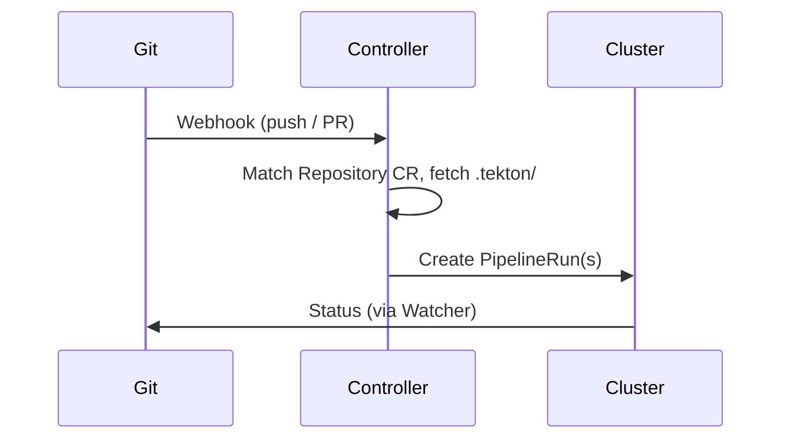

This page shows the event flow diagrams for Pipelines-as-Code.

## Diagram of a Pull/Merge Request Flow

*Detailed sequence from Git event through controller, resolution, and PipelineRun execution. Click to open full size.*

## High-level flow

