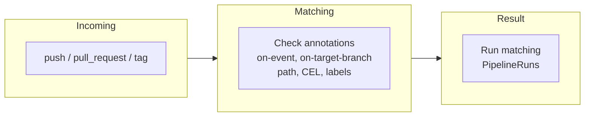

Event matching is the mechanism Pipelines-as-Code uses to decide which PipelineRuns to execute in response to Git provider activity. Every time a pull request opens, a commit pushes, or a tag is created, Pipelines-as-Code inspects the annotations on each PipelineRun in your `.tekton/` directory and runs only the ones whose criteria match the incoming event. This page covers the two core annotations -- `on-event` and `on-target-branch` -- that control basic matching. For more advanced filtering, see [CEL Expressions](), [Path-Based Matching](), and [Comment and Label Matching]().



## Matching by event and branch

You match a PipelineRun to an event by adding annotations to its metadata. For example:

```yaml
metadata:
  name: pipeline-pr-main
annotations:
  pipelinesascode.tekton.dev/on-target-branch: "[main]"
  pipelinesascode.tekton.dev/on-event: "[pull_request]"
```

Pipelines-as-Code matches the PipelineRun `pipeline-pr-main` when a `pull_request` event targets the `main` branch.

You can specify multiple target branches by separating them with commas:

```yaml
pipelinesascode.tekton.dev/on-target-branch: [main, release-nightly]
```

## Matching push events

Besides `pull_request` events, you can also match PipelineRuns on `push` events. For example, the following PipelineRun runs whenever you push a commit to the `main` branch:

```yaml
metadata:
  name: pipeline-push-on-main
  annotations:
    pipelinesascode.tekton.dev/on-target-branch: "[refs/heads/main]"
    pipelinesascode.tekton.dev/on-event: "[push]"
```

You can specify the full ref like `refs/heads/main` or the short form like `main`. Glob patterns also work -- for example, `refs/heads/*` matches any branch and `refs/tags/1.*` matches all tags starting with `1.`.

## Matching tag pushes

The following example matches when you push the `1.0` tag:

```yaml
metadata:
name: pipeline-push-on-1.0-tags
annotations:
  pipelinesascode.tekton.dev/on-target-branch: "[refs/tags/1.0]"
  pipelinesascode.tekton.dev/on-event: "[push]"
```

Pipelines-as-Code runs the PipelineRun `pipeline-push-on-1.0-tags` when you push the `1.0` tag to your repository.


GitHub does not send webhook events when more than three tags are pushed simultaneously (e.g., with `git push origin --tags`). To ensure pipeline runs are triggered for all tags, push them in batches of three or fewer. [See GitHub's docs here](https://docs.github.com/en/actions/reference/workflows-and-actions/events-that-trigger-workflows#create).


## Required annotations and parallel execution

Matching annotations are required; without them, Pipelines-as-Code does not match your PipelineRun. When multiple PipelineRuns match the same event, Pipelines-as-Code runs them in parallel and posts each result to the Git provider as soon as the PipelineRun finishes.



* Pipelines-as-Code matches payloads only for supported events, such as when a pull request opens or updates, or when a branch receives a push.

* You typically need both `on-target-branch` and `on-event` annotations for a match, except when you use [CEL expressions]() or [comment-based matching]().

